# Cascais Micromobility: abandoned bike detection and collection

**Hack the City 2026 · Challenge #9 (Cascais).** This is a working prototype for the municipality. It detects shared bikes left outside a station area for too long, builds and updates the road route to collect them, and turns the operator's own data into decisions: where bikes are abandoned, how well the provider responds at each station, and where a new station would help most.

<p align="center">
  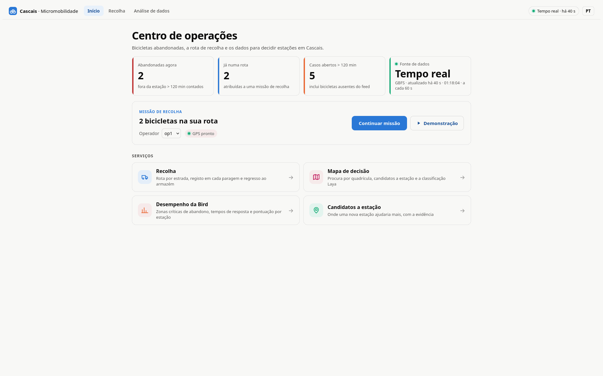
  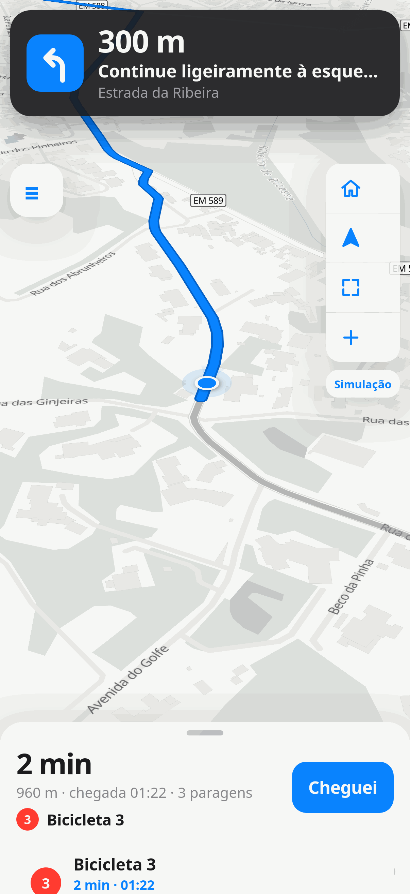
</p>

> **The rule:** a bike is **abandoned** when it stays more than **30 m outside a station area** for more than **120 minutes**. Only minutes between **08:00 and 20:00 Lisbon time** count, and this window can be switched off. The rule lives in one place (`project/.env`) and every screen applies it the same way.

## Hackathon submission

| | |
|---|---|
| **Project name** | Cascais Micromobility: abandoned bike detection and collection |
| **Selected challenge** | Hack the City 2026 · Challenge #9: *Plan collection of abandoned micromobility vehicles (Cascais)* ([brief](chalange.md)) |
| **Team** | David Correia (@davidfgcorreia) · Gonçalo Martins (@goncalofecha) · Diogo Sousa (@dmrllsousa) |
| **Repository** | https://github.com/davidfgcorreia/hackcity |
| **Demo video** | https://youtu.be/xIjXYXA3tug |
| **Submission document (PDF)** | [docs/presentation/cascais-micromobility-submission.pdf](docs/presentation/cascais-micromobility-submission.pdf): every answer below in one 4-page document |
| **Final slides (PDF)** | [docs/presentation/cascais-micromobility-slides.pdf](docs/presentation/cascais-micromobility-slides.pdf) (15 slides; the same images are in [docs/media/](docs/media/)) |

**The problem.** Shared bikes in Cascais must be returned to a station area, but many are left outside it. They block pavements, look like neglect, and the municipality has no tool to see them in time or to check whether the operator collects them. In Bird's own data for 19 Aug–8 Sep 2026 there were **754 abandonments** (more than 120 minutes more than 30 m outside a station). **55.7 % were never collected by Bird**, and when Bird did collect, it was a **median of 12.3 h after the limit**.

**The proposed solution.** One web platform with three parts:
1. **Real-time detection** of abandoned bikes from the operator's live GBFS feed, with the exact challenge rule (30 m buffer, 120 minutes), a case timeline and explicit uncertainty.
2. **A dynamic collection route** on real roads from the municipal depot, re-planned whenever the pool of bikes changes, and a **mobile field app** that records the bike ID, a photo and a description at every stop as evidence.
3. **A decision map** for planning: supply and demand KPIs per station or any grid square, public transport context, an operator performance score per station, and **Laya**, an open model that ranks where a new station would help most.

**Target users and beneficiaries.**
- *Municipal mobility staff (Cascais Próxima / Câmara Municipal)*: see abandoned bikes live, send a team, and hold the operator to its contract with evidence.
- *Field collection teams*: a phone app that tells them where to go next and records what they found.
- *Planners and decision makers*: evidence for where to add, move or resize stations.
- *Residents and riders*: clearer pavements and bikes available where people actually need them.

**The prototype.** It runs end to end on a laptop and is described feature by feature in [What it does](#what-it-does). The hands-free [presentation demo](#3-presentation-demo-hands-free-about-30-s) (`/field?sim`) shows a van leaving the depot, reaching a bike and recording a pickup with photo and description. Screenshots of every screen are in the [gallery](docs/prints/README.md).

**Technology and data.**
- *Technology:* React + Vite + TypeScript and MapLibre/Leaflet (web and field app); FastAPI + Postgres (operations); FastAPI + PostGIS + DuckDB (analysis); OSRM on OpenStreetMap (road routing); Docker Compose. See [Architecture](#architecture).
- *Data:* the challenge datasets in `datasets/` (Bird trips and vehicle events, stations and GBFS snapshots, Waze traffic, MobiCascais card validations and dated transit operation plans), Bird's **live GBFS feed**, and **TML / Carris Metropolitana** live vehicle positions. Details in the [data source audit](docs/data_source_audit.md).

**Expected impact.**
- Bikes are flagged **at the 120-minute limit** instead of hours later, so they spend less time blocking public space.
- Every collection leaves evidence (photo, position, time), so the municipality can **measure the operator's response** station by station and use it in contract discussions.
- Collection trips follow a short road route that updates itself, which saves driving time and fuel.
- Station investment is guided by observed demand and abandonment pressure, with the reasons and uncertainty shown next to every recommendation.

**Implementation and scalability.**
- **Any operator, any city:** detection only needs a standard GBFS feed and station polygons. The rule, the depot, the van size and the time window are settings in one file (`project/.env`), and OSRM can load any OpenStreetMap region.
- **Pilot path:** run it next to the current process for one month in Cascais, compare its detections with the field, then tune the rule and the score weights with the municipality.
- **Production steps:** authentication and roles, hosting on municipal or cloud infrastructure, a data-sharing agreement for the operator's event log, and more operators through the same GBFS interface. See [Known limits](#known-limits) and [next steps](docs/NEXT_STEPS.md).

**Access, testing and demonstration.** Follow [Run it](#run-it): `make up`, `make seed`, then open http://localhost:5173. The demo is at `/field?sim`, the decision map at `/data` and the tests run with `make test` and `docker compose exec analytics pytest -q`. The analysis data dump is in a private GitHub release (it contains hashed card IDs), so the `/data` page needs team access or a rebuild from `datasets/`.

## Contents

- [Hackathon submission](#hackathon-submission)
- [What it does](#what-it-does)
- [Key findings from the data](#key-findings-from-the-data)
- [Architecture](#architecture)
- [Run it](#run-it)
- [Configuration](#configuration)
- [Repository layout](#repository-layout)
- [Documentation](#documentation)
- [Known limits](#known-limits)

## What it does

### 1. Real-time detection of abandoned bikes

- The API reads Bird's live **GBFS** feed every 60 s. It tracks parked bikes by position, type and battery, because the public bike id rotates.
- The API measures how far each bike is outside its station polygon plus 30 m, in a metric projection (EPSG:3763), and counts the enforcement-clock minutes it has been parked.
- A bike becomes a **case** that moves through `candidate → eligible → assigned → picked_up / resolved`. Every step is recorded on the case's timeline, with its evidence.
- Uncertainty is shown, not hidden. A bike missing from the feed may have been collected, may be charging, or may just have a stale position, so it becomes **uncertain** and is never treated as collected.
- **Replay mode** runs the same detector over the 19 Aug–8 Sep 2026 history at up to 1,800× speed, and **Back to live** switches back. Missions, counts and maps only ever use the current mode's cases.

### 2. Dynamic collection route

- A pickup mission starts from the operator's GPS position. It fills the van (capacity 6) with the oldest eligible bikes and ends at the **Complexo Multisserviços** depot in Alcabideche.
- Routes are real **road routes** from a local **OSRM** engine on an OpenStreetMap graph from Cascais to Lisbon. If OSRM is unreachable, the route falls back to a straight line and is labelled as such.
- The route is **re-planned automatically** whenever the pool of bikes changes: a new abandonment, a bike collected, a rider starting a trip, or the provider picking a bike up. The operator gets a "route changed" notice with the reason.
- The **mobile field app** (`/field`) has turn-by-turn directions, follow and overview camera modes, and a stop list with times and distances. At each bike the operator records the outcome (collected, not found, in use, unsafe, …) with the **bike ID, a photo and a description**. Outcomes are queued offline and synced later.

<p align="center">
  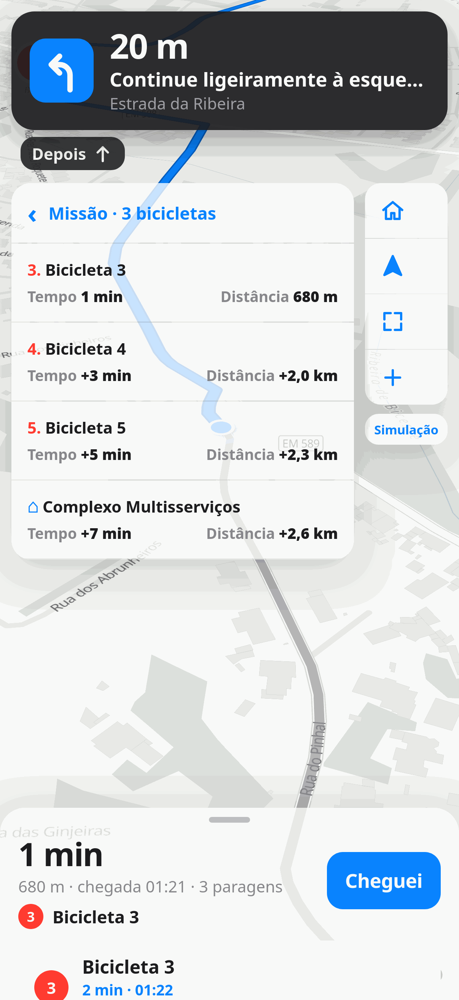
  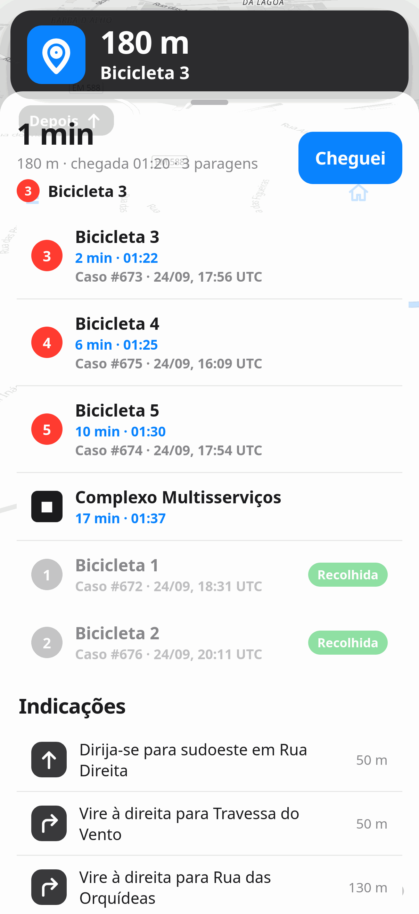
  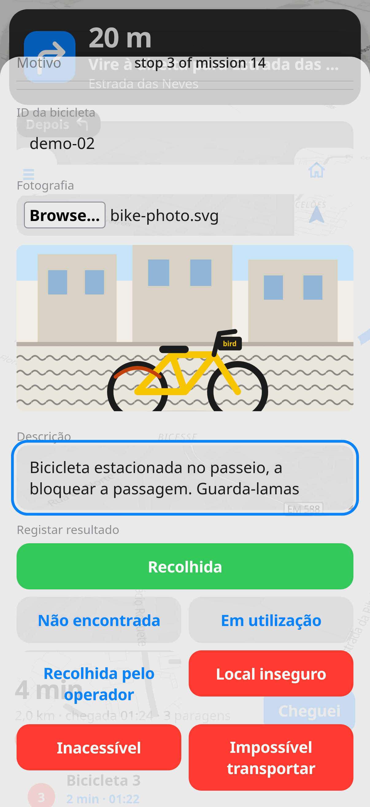
  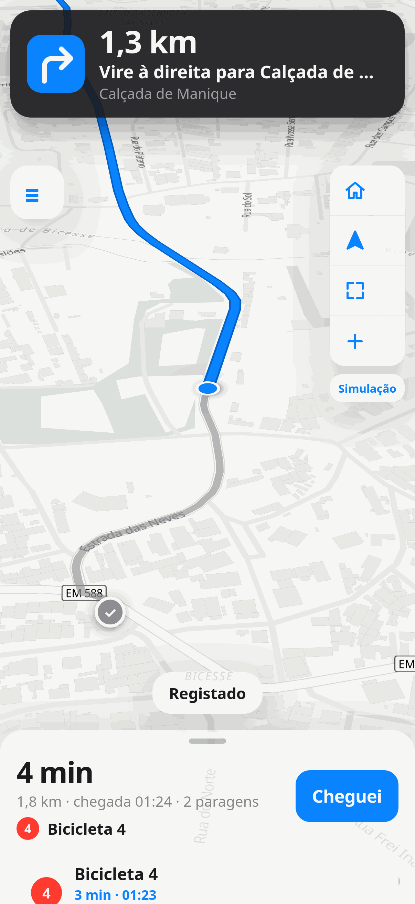
</p>

### 3. Presentation demo (hands-free, about 30 s)

Open `/field?sim` or press **Demonstração** on the home page.
1. Five fixed demo bikes are reset. They sit at real past abandonment spots 0.4–1.9 km from the depot.
2. The van drives quickly out of the Complexo Multisserviços to bike 1.
3. The stop sheet then plays by itself: it selects a photo, types a description and presses **Recolhida**.
4. The van heads toward bike 2 and the demo ends.

**Reiniciar demonstração** replays it. Demo bikes use their own source and operator, so they never mix with real cases, routes or counts.

### 4. Decision map (`/data`)

One map for historical planning evidence and live operations.

- **Metric grid from 50 to 1,000 m.** Squares and candidate rankings are recalculated from the source points at the chosen size, date and hour.
- **Layers:**
  - trip ends and starts, parking outside the zone, bikes parked outside for more than 120 min, and provider pickups;
  - card boardings (people hotspots);
  - bus and rail routes (coloured by historical delay), stops and vehicles, both timetable estimates and live TML / Carris Metropolitana GPS;
  - stations with their 30 m zone, and live station balance;
  - live bikes and cases.
- **Station candidates** are ranked and shown in magenta, with the **Laya** evaluation at every square size, cached per size. Two candidates can be compared side by side.
- **Drill-down** on any square, station, stop, vehicle or case.
- **Sharing and export:** the view can be shared by URL, and there are CSV exports, a print report, and a **Sources & definitions** drawer. Every label is in **PT/EN**.

<p align="center">
  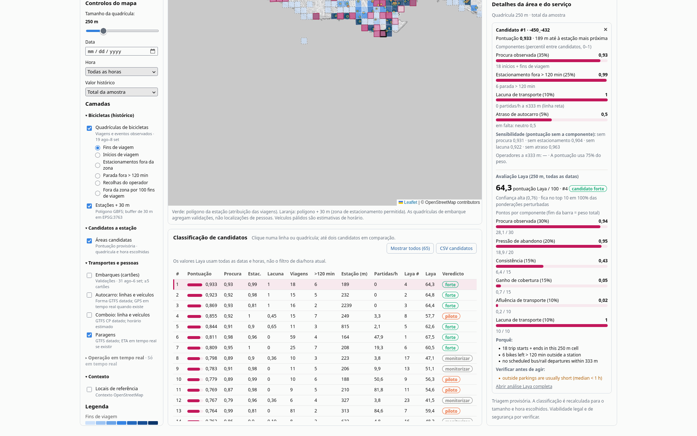
  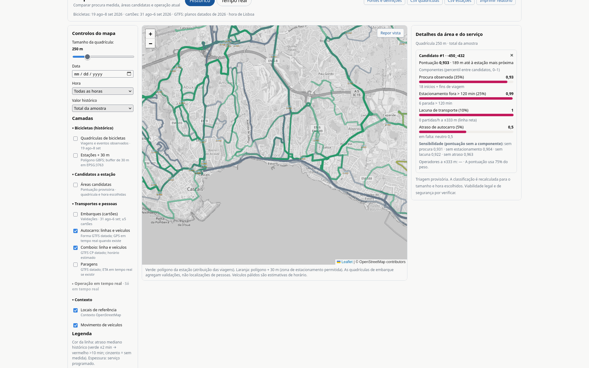
</p>

### 5. Bird performance: is the operator doing a good job?

This is reconstructed from Bird's own event log.
- **KPIs:** abandonments, the share Bird never collected, Bird's response time after the 120-minute limit, abandonments prevented, and abandonments Bird itself created by dropping bikes outside a zone.
- **Map, Abandonos view:** a **heat cloud of abandonment hotspots**, abandonments coloured by how they ended, and the bikes **abandoned right now** from the live feed.
- **Map, Desempenho por estação view:** a provisional **0–100 score per station**. It averages availability, Bird's share of refills when the station went empty, and Bird's collection rate for abandonments nearby. Stations are coloured red / amber / green (validated for colour blindness); a second view shows empty service hours. The view adds a score histogram and the best and worst stations.

<p align="center">
  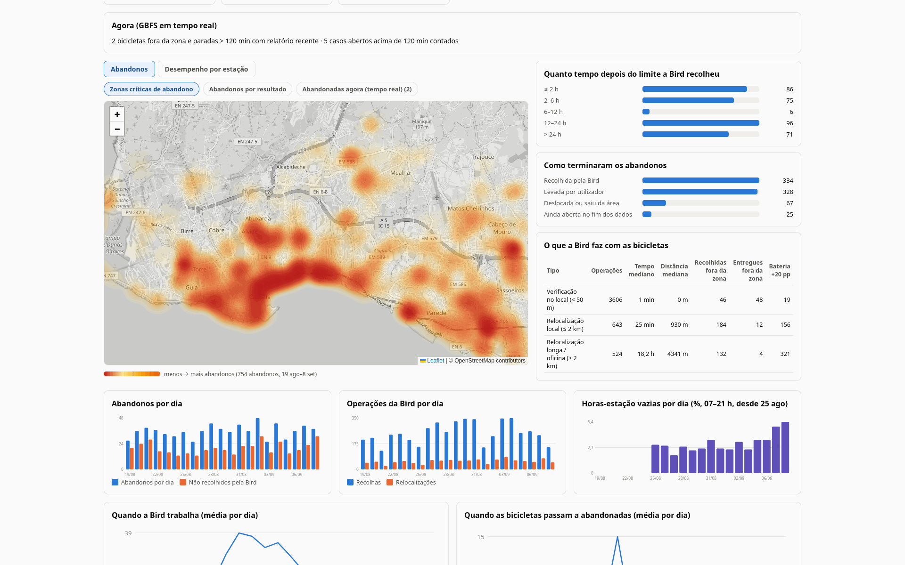
  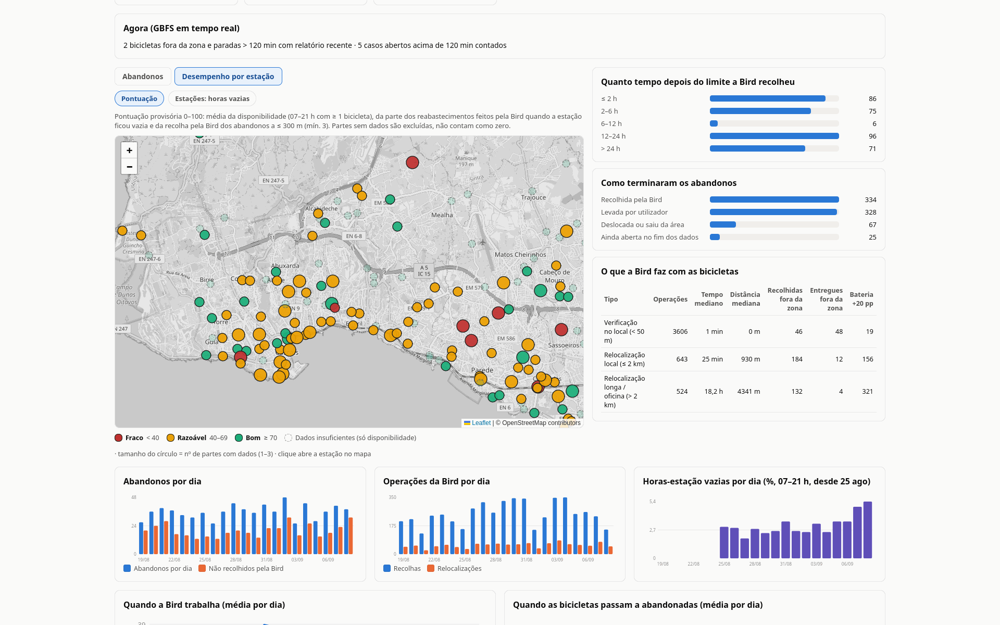
</p>

### 6. Where to put new stations: the Laya model

**Laya** is an open, deterministic recommendation model ([`laya.py`](project/analytics/analytics/laya.py)).
- **Score:** it re-ranks candidate areas (more than 150 m from any station, at least 5 outside parkings) using observed demand, abandonment pressure, consistency, coverage gain, transit footfall and transit gap.
- **Beside each score:** confidence, robustness (500 re-weightings of the weights), a verdict (*strong candidate*, *pilot first*, *monitor*), reasons and caveats.
- **Always visible:** the weights, the method and what it does *not* know.

<p align="center">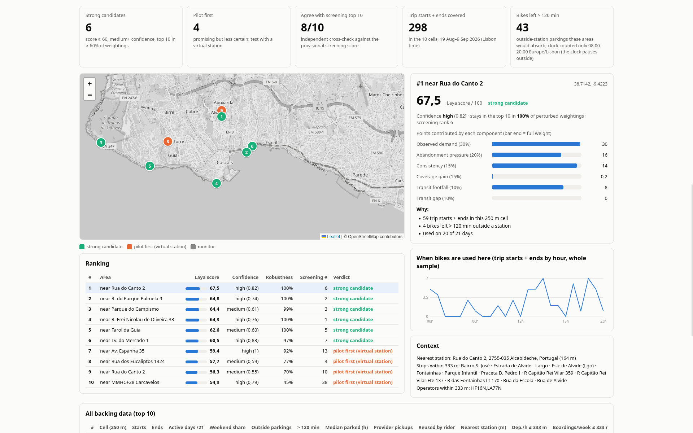</p>

### 7. Supply and demand KPIs, and context

| Tab | What it shows |
|---|---|
| **Resumo** | The headline findings, each labelled as observed, estimate or screening. |
| **Fluxos nas estações** | Departures and arrivals per station and hour, and net flows. |
| **Transportes** | MobiCascais boardings by hour and median departure delay per line (M01–M36). |
| **Viagens** | Card journeys between municipalities, and transfers. |
| **Meteorologia** | Trip starts by rain, temperature and wind (a descriptive association only). |
| **Dados** | What was loaded, what was filtered out, and the geolocation coverage of each source. |

All screenshots, with captions, are in the **[screenshot gallery](docs/prints/README.md)**.

## Key findings from the data

These use Bird's event log, 19 Aug–8 Sep 2026, with the 08:00–20:00 clock.

- **754 abandonments** (35.9 per day). **55.7 %** were never collected by Bird: riders took 328, 25 were still open at the end of the data, and 67 moved or left the area.
- When Bird did collect, it was a **median of 12.3 h after the limit**. Our detector would have flagged the same bikes at the limit.
- **83.7 %** of trip ends are inside the permitted zone, but only **40.5 %** are inside the painted station area. The 30 m margin does most of the work.
- **43 abandonments started with Bird's own drop-off** outside a zone. **Riders, not Bird, refilled most empty stations** (120 refills against 28).
- **65 candidate areas** are ranked at 250 m, with provisional weights and missing inputs shown as missing.

## Architecture

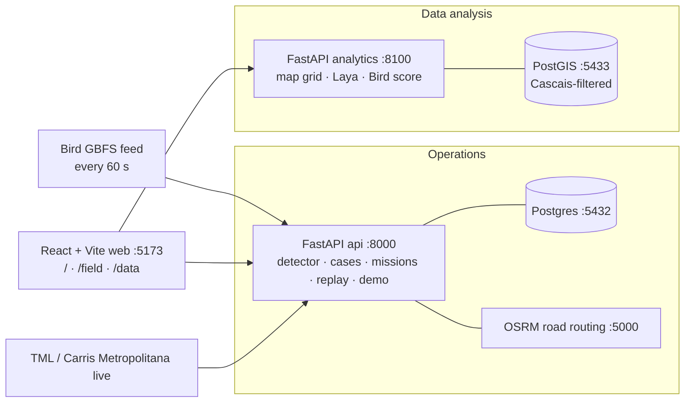

- **Operations and analysis are separate stacks.** Operations decisions come from the operations API; the historical analysis is read-only.
- **Pure logic is in `backend/app/core`** (geometry, vehicle state, detector, enforcement clock, routing) and is unit-tested. It never imports services or API code.
- **All thresholds come from one config file**, `backend/app/config.py`, which reads `.env`. The frontend shows the same rule through `GET /api/rules`.

## Run it

**Prerequisites:** Docker with Compose, about 4 GB of free RAM, and an internet connection for map tiles.

```bash
cd project
cp .env.example .env
make up            # db :5432 · api :8000 · web :5173 · analytics :8100 · analytics-db :5433 · osrm :5000
make seed          # operations data: 157 stations + 53,764 bicycle events from ../datasets
```

**Road routing** is a one-time build of about 5 minutes; it downloads the OpenStreetMap extract for Portugal:
```bash
make osrm
```

**Analysis data** (for `/data`). Choose one:
```bash
make analytics-restore            # team members: restore the 122 MB Cascais-filtered dump from the private GitHub release
# or rebuild from the raw files in datasets/ (about 15 GB, finalset included):
docker compose exec analytics python -m analytics.ingest
docker compose exec analytics python -m analytics.derive
```

**Open:**

| Page | URL |
|---|---|
| Operations home | http://localhost:5173/ |
| Field app (phone) | http://localhost:5173/field. On a phone on the same Wi-Fi use `http://<laptop-ip>:5173/field` |
| Presentation demo | http://localhost:5173/field?sim |
| Data analysis / decision map | http://localhost:5173/data |
| Live cases on the map | http://localhost:5173/data?view=live |
| Bird performance | http://localhost:5173/data#Bird |
| API docs | http://localhost:8000/docs · http://localhost:8100/docs |

**Useful targets:**

| Command | What it does |
|---|---|
| `make test` | Backend tests: detector, routing, cases, missions, demo, live feed. |
| `docker compose exec analytics pytest -q` | Analysis tests: parking intervals, Laya, cache, Bird score, map API. |
| `make demo` | Replay mode, jumped to a busy morning, with op1's route. `POST /api/live/start` or **Voltar ao tempo real** returns to live. |
| `make enforce-window-off` / `-on` | Count the 120-minute clock around the clock, or only 08:00–20:00. This also rebuilds the affected analysis tables. |
| `make analytics-map-prep` | Prepare an older analysis dump for the current map. |
| `make logs` · `make psql` · `make reset-db` | Logs, database shell, and wiping everything (development only). |

**Frontend only, without a backend:** `VITE_USE_MOCKS=true docker compose up web`.

**Browser checks** (Playwright image built from `tools/Dockerfile.shots`):
`docker run --rm --network host -v "$PWD/tools:/tools:ro" -v /tmp/shots:/out hackcity-shots python /tools/verify-data.py`

> **Troubleshooting:** if `docker compose` can't find the containers, check `docker context ls`. Docker Desktop and the system engine are different contexts, so use `DOCKER_CONTEXT=default`.

## Configuration

All operational rules live in `project/.env` (see `.env.example` for comments).

| Variable | Default | Meaning |
|---|---|---|
| `ABANDON_MINUTES` | `120` | Counted minutes outside the zone before a bike is abandoned. |
| `BUFFER_M` | `30` | Metres around the station polygon that still count as parked correctly. |
| `ENFORCE_WINDOW` · `ENFORCE_FROM_HOUR` · `ENFORCE_UNTIL_HOUR` | `true` · `8` · `20` | Only minutes in this window (Europe/Lisbon) count. |
| `DEPOT_LAT` · `DEPOT_LNG` | Complexo Multisserviços | Start and end of every mission. |
| `VAN_CAPACITY` · `DETOUR_FACTOR` | `6` · `1.3` | Van size and allowed detour when planning. |
| `LIVE_ENABLED` | `true` | Poll the live GBFS feed at startup. |
| `REPLAY_SPEED` | `360` | Simulated seconds per real second in replay. |

## Repository layout

```
README.md             this file
chalange.md           the challenge brief
datasets/             supplied data (read-only; mounted into the containers)
docs/                 product, architecture and analysis docs · docs/prints/ screenshots
project/
  docker-compose.yml  all services      Makefile   everyday commands
  backend/            operations API (FastAPI): app/core (pure, tested) · services · api · tests
  analytics/          analysis API + ingest/derive pipeline (DuckDB → PostGIS) · laya.py · bird_score.py
  frontend/           React + Vite: pages/ (Home, Field, Insights/DecisionMap) · components/
  tools/              OSRM build, dump/restore, screenshot and verification scripts
```

## Documentation

See the [documentation index](docs/README.md). The main entry points:

- [Operations architecture](docs/operations_architecture.md) and [operations requirements](docs/operations_requirements.md): the detection rule, case lifecycle, missions and the field app.
- [Analytics architecture and findings](docs/analytics_architecture.md): data lineage, the Laya model, caching and measured results.
- [Decision map guide](docs/decision_map.md): every layer, the Bird tab, calculations and freshness.
- [Handoff](docs/HANDOFF.md) and [next steps](docs/NEXT_STEPS.md): current state and backlog.
- [Developer runbook](project/README.md).

## Known limits

- **A bike missing from the feed is uncertain.** It is never counted as collected; confirmation in the field is what closes a case.
- **The historical sample is short:** bikes cover 19 Aug–8 Sep 2026 and card validations cover one week (31 Aug–6 Sep). A card is not a person, and CP rail validations are missing.
- **Some measures are provisional:** candidate weights, the Laya weights and the station score are not approved KPIs. A station site still needs legal, safety and accessibility review.
- **Station stock is reconstructed** from events and is a lower bound; station capacity is not published.
- **The live station-status target** can be saved through an unauthenticated endpoint. This is fine for a local prototype only.
