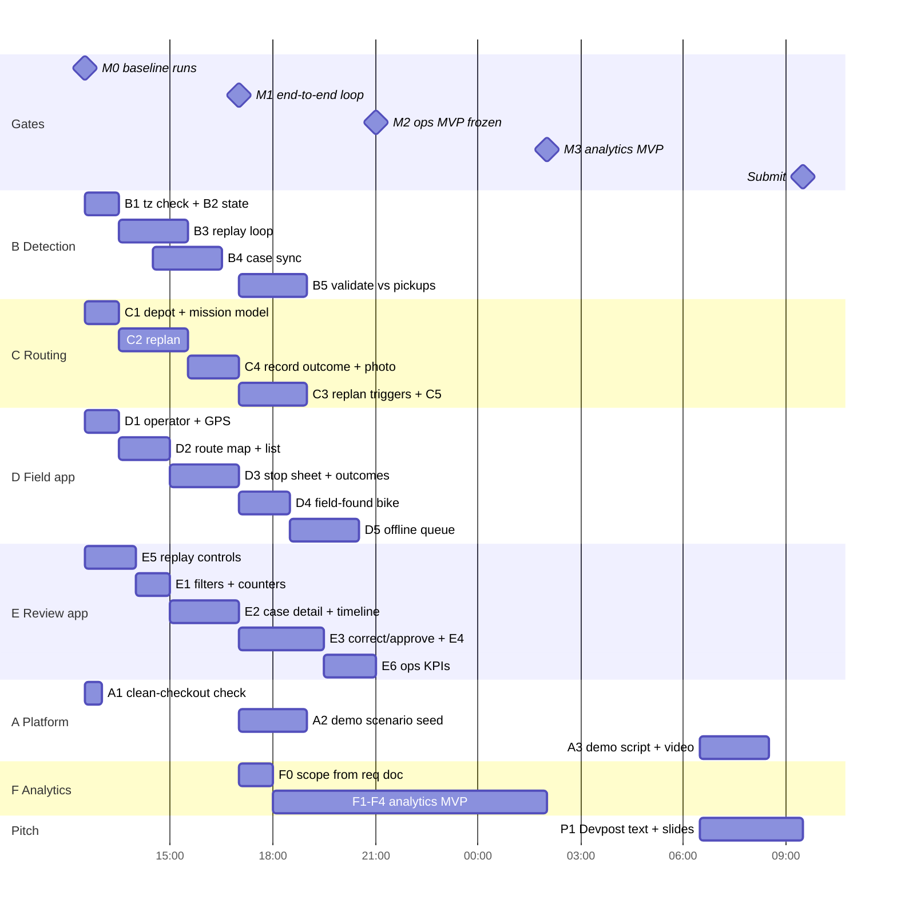

# Task Timeline — Parallel Workstreams

> **Status (24 Sep, evening):** backend workstreams B and C are done, and the field app (D) and review app (E) are built on top of them. ✅ = done. Still open: **B5** validation numbers, **A1**/**A3**, workstream **F** analytics and the pitch (**P1**/**P2**). **Live detection from the provider GBFS feed runs by default** (`GET /api/live`); `make demo` switches to replay mode and sets up a route for op1.

**Now: Thu 24 Sep, 12:30 · Devpost deadline: Fri 25 Sep, 10:00 (about 21 h)**

Priority order: **operational MVP first**, then the data-analysis MVP, then polish and the pitch. Design is in [operations_architecture.md](operations_architecture.md). Current follow-up analysis and pitch findings are in [NEXT_STEPS.md](NEXT_STEPS.md); [frontend links](FRONTEND_LINKS.md) are available for review.

## How to run in parallel without collisions

- **One workstream per person or agent**, each on its own branch or git worktree (`feat/B-replay`, `feat/D-field`, …). Merge to `main` often. `main` must always run the demo.
- **File ownership** is listed in the table below. Edit files owned by another workstream only after telling its owner.
- **Contract files:** `backend/app/schemas.py` and `frontend/src/types.ts` change together, in one small commit, announced to the team.
- The frontend never waits for the backend. Run `VITE_USE_MOCKS=true docker compose up web` and extend `src/mocks.ts`.
- Each task ends with a test, or with a URL or screenshot that shows it working.

| WS | Name | Owns |
|---|---|---|
| A | Platform & demo | `docker-compose.yml`, `Makefile`, `scripts/`, `README.md`, demo scenario |
| B | Detection pipeline | `app/core/vehicle_state.py`, `app/core/detector.py`, `app/services/replay.py`, `app/services/cases.py`, `app/api/replay.py` |
| C | Routing & missions | `app/core/routing.py`, `app/services/missions.py`, `app/api/missions.py` |
| D | Field app (mobile) | `frontend/src/pages/FieldPage.tsx`, `frontend/src/components/field/*`, offline queue |
| E | Review app (desktop) | `frontend/src/pages/ReviewPage.tsx`, `frontend/src/components/review/*`, `app/api/cases.py` |
| F | Data analytics | `project/analytics/` (new), starts at Gate M1 or when a person is free |

## Timeline

## Phase 1 — MVP core (12:30 → 17:00), Gate **M1**

**M1 means:** in replay, a bike becomes `eligible` → it appears as a stop on the `/field` route → the operator records `picked_up` with a photo → the stop disappears and the route recalculates.

| ID | Task | Depends on | Done when |
|---|---|---|---|
| **B1** ✅ | Check the timezone of `viagens.xlsx`: plot trip_start by hour, where the Lisbon peak should appear at 8–9 h local. Set `SOURCE_TZ` accordingly. | — | The decision is noted in `operations_architecture.md` §4. |
| **B2** ✅ | Load events from the DB ordered by `event_time` and fold them into `dict[device_id, VehicleState]`. Build `ZoneIndex` from the `stations` table once at startup. | — | Unit test: fold of 3 synthetic events. |
| **B3** ✅ | Replay loop: an asyncio task that advances `sim_time` by `speed × dt`, folds new events, calls `evaluate()` for all at-rest bikes, and calls `cases.sync_vehicle`. `/replay/step` runs one tick. | B2 | `POST /replay/step?minutes=180` creates cases. |
| **B4** ✅ | `services/cases.sync_vehicle` following its docstring rules: one open case per device, and a `CaseEvent` for each status change. | B3 contract | Test: candidate → supported → eligible → resolved on a trip start. |
| **C1** ✅ | Put the real depot coordinates in `.env`. Create a mission on the operator's first request, starting from their position. | — | `GET /missions/current` returns a mission. |
| **C2** ✅ | `replan()`: eligible, unblocked, approved cases → `plan_mission` → rewrite planned stops plus a final depot stop. Set cases to `assigned`, increase `version`, and set `last_change`. | C1 | `POST /missions/replan` returns ordered stops. |
| **C4** ✅ | `record_outcome()`: idempotent on `client_uuid`, saves the photo to `/uploads`, updates the stop and case status, sets `blocked_reason` for unsafe, inaccessible and unable_to_load, then replans. | C2 | curl multipart pickup → case `picked_up`. |
| **D1** ✅ | Operator picker (op1/op2) and `navigator.geolocation` watch, used as the replan start position. | — | Position dot on the map. |
| **D2** ✅ | Route polyline, numbered stops, map/list toggle, and a "next stop" card. | D1 (mocks) | Works with `VITE_USE_MOCKS=true`. |
| **D3** ✅ | Stop sheet: case ref, bike ID, last position and time, reason, uncertainty badge. Seven outcome buttons. Pickup requires a bike ID and a photo (`<input type=file accept=image/* capture=environment>`). | D2 | Pickup is posted to the API. |
| **E5** ✅ | Replay control bar: start, pause, step +30 min, sim clock, speed. **Demo-critical.** | B3 API shape | Buttons call `/api/replay/*`. |
| **E1** ✅ | Status filter chips with counts. Map colours by status. | — | — |
| **E2** ✅ | Case detail drawer: evidence timeline, station-boundary distance, 120-minute calculation, reason. | — | Opens from the list and the map. |
| **A1** | Fresh clone → `cp .env.example .env && make up && make seed && make test` works. Fix anything that fails. | — | Commands documented in README. |

## Phase 2 — Dynamic behaviour and robustness (17:00 → 21:00), Gate **M2** (ops feature freeze)

**M2 means** all eight acceptance behaviours in operations_requirements §10 can be shown live.

| ID | Task | Depends on | Done when |
|---|---|---|---|
| **C3** ✅ | Replan triggers: a new eligible case, an assigned bike going `gone` (the stop is removed and `last_change="bike X started a trip — removed"`), an approval, and an outcome. | B4, C2 | A banner appears in `/field` during replay. |
| **C5** ✅ | Capacity queue and depot legs: when the van is full, the route ends at the depot and the remaining cases stay `eligible` in a queue. | C2 | Test with capacity 2 and 5 cases. |
| **B5** ✅ | Validation: the share of `maintenance_pick_up` events that the detector flagged beforehand, and the average lead time. **This number goes in the pitch.** | B3 | Numbers in `docs/`. |
| **D4** ✅ | "Found another bike" form → `POST /cases/field`. Shows "awaiting approval". | — | The case appears in review with `needs_approval`. |
| **D5** ✅ | Offline: keep the last mission in `localStorage`, queue outcomes in IndexedDB, resend with the same `client_uuid`. Show a "pending sync" badge. | D3 | Works with DevTools offline. |
| **E3** ✅ | Correct position/status with a reason, approve a field case, block or unblock a case. | — | The timeline shows before and after values. |
| **E4** ✅ | Export button → JSON download of `/cases/{id}/export`. | — | — |
| **E6** ✅ | Ops KPI strip: cases by status, not-found rate, median time from eligible to pickup. | C4 | — |
| **A2** ✅ | Demo scenario: choose a replay window with several abandonments, one trip start on an assigned bike, and one provider pickup. Save it as `make demo`. | B3 | A 2-minute scripted run works. |

## Phase 3 — Data-analysis MVP

> **Status:** ingest, analysis tables and the `/insights` page are done. See [analytics_architecture.md](analytics_architecture.md) for commands, findings and the list of what is not built yet.

### Original plan (17:00 → 02:00, then F owns it), Gate **M3**

Scope comes from [analytics_prediction_requirements.md](analytics_prediction_requirements.md). Keep it separate in `project/analytics/` (a notebook or scripts writing to `analytics/derived/`). Show the result as a third page, `/insights`, fed from static JSON.

| ID | Task |
|---|---|
| **F0** ✅ | Choose 2–3 outputs from the requirements doc's recommended defaults and write down which ones. |
| **F1** ✅ | Recovery KPIs per station catchment and H3 hex: abandonments per 100 trip ends, idle hours, time to provider pickup. |
| **F2** ✅ | Station opportunity: hexes with high demand and many out-of-station parkings but no station. |
| **F3** ✅ | Supply/demand by hour: departures, arrivals, net flow per station. |
| **F4** ✅ | Export JSON and add the `/insights` map page (reusing `BaseMap`). |

## Phase 4 — Stabilise and pitch (02:00 → 09:30)

| ID | Task |
|---|---|
| **Q1** | Bug bash on the demo scenario only. No new features after M2 unless they are demo-critical. |
| **A3** | Demo script (2 min) and a recorded backup video in case Wi-Fi fails. |
| **P1** | Devpost answers (problem, solution, user, prototype, impact, future) and 3-minute pitch slides. Lead with the live demo. |
| **P2** | Submit by **09:30** (30 min buffer). |

## Cut list if behind schedule (cut from the top)

1. E6 KPIs strip → show the numbers on a slide.
2. D5 offline queue → keep only the last route in `localStorage` and describe the queue as future work.
3. D4 field-found bike → show it with the API in Swagger.
4. F2 or F3 → keep F1 only.
5. **Never cut:** B3, B4, C2, C3, D3, E5. These are the demo loop.
