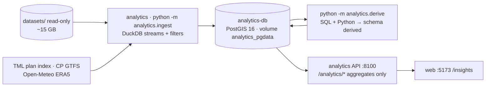

# Data Analysis — Architecture and Findings

**24 September 2026 · implements the bounded first demo of [analytics_prediction_requirements.md](analytics_prediction_requirements.md)**

The analysis side has its own persistent PostGIS database and its own service, separate from the operations stack. The source files are large (about 15 GB), mostly cover the whole Lisbon metropolitan area, and span two years. The ingest keeps only what concerns Cascais, records every filter it applies, and the `/insights` web page shows the results.

## 1. Containers

| Command (from `project/`) | What it does |
|---|---|
| `docker compose up -d analytics-db analytics` | Starts the database (port 5433) and the API (port 8100). |
| `docker compose exec analytics python -m analytics.ingest [step…]` | Collects the inputs. Steps: `reference bike gtfs bus26 transit26 transit25 weather`. The full run takes about 3 minutes. |
| `docker compose exec analytics python -m analytics.derive` | Rebuilds every analysis table (about 1 minute). |
| `docker compose exec analytics pytest -q` | Runs the tests for the parking-interval logic and the Laya model. |
| `docker run --rm --network host -v $PWD/tools:/tools -v /tmp/shots:/out hackcity-shots python /tools/shoot.py` | Takes screenshots of every `/insights` tab and prints console errors. Build the image first with `docker build -t hackcity-shots -f tools/Dockerfile.shots tools`. |

Every ingest and derive step writes a row to `meta.ingest_log` (rows read and kept, the filter applied, and sources with URL/sha256/retrieval time). The **Data** tab shows this log.

## 2. What was collected and how it was filtered

**Study area:** the envelope of the 157 bike stations and the 421 `stops.csv` stops in the municipality of Cascais, plus about 1.5 km (lat 38.665–38.780, lon −9.500 to −9.295). Coordinate filters use this box. Validation filters use the stricter rule `municipality_name = 'Cascais'`, because the box also covers parts of Oeiras and Sintra.

| Table | Source | Kept / read | Filter |
|---|---|---|---|
| `bike.stations`, `bike.trips`, `bike.events` | bike sample | 157 · 16,886 · 53,764 | all rows (already Cascais); naive times assumed UTC |
| `gtfs.*` (plans, stops, routes, trips, stop_times, calendars, shapes) | TML plan index: the plan **active 31 Aug–6 Sep 2026** for every operator in the validations, plus CP | MobiCascais SBF83 120k stop times, CP 76XA2 12k, Carris Metropolitana 41 XS3H8 727k; other operators' stops only | trips that call at a stop inside the box |
| `transit26.validations` | 2026 validations | **551,098 / 10,929,425** | **every** validation of the 50,748 cards with at least one validation in Cascais (MobiCascais, or a Carris Metropolitana stop in Cascais) |
| `transit26.vehicle_positions` | 2026 vehicle files (finalset supersedes `datasets/vehicles`) | 2,093,404 / 35,453,198 | inside the box; deduplicated by `_id` |
| `bus26.services_*` | MobiCascais realised service spreadsheets M01–M44 | 11,669 · 990 | all rows; local time zone |
| `transit25.*` | October 2025 APEX, rides and vehicle events | 181k / 4.5M · 16k / 127k · 2.3M | Cascais cards / trips / box; **APEX card number replaced by a salted SHA-256**; `driver_id` dropped |
| `weather.hourly` | Open-Meteo ERA5, 18 Aug–8 Sep | 528 h | grid point 38.75, −9.25 (non-commercial API terms) |
| Waze | — | excluded | every row is in Lisbon; no Cascais road observations |

**Key data finding:** the dated plans place **100 %** of the MobiCascais 2026 validations on the map, and of Metro, Carris and Carris Metropolitana too. Matching against `stops.csv` gave 0 %. This closes the join gap recorded in [finalset_data_review.md](finalset_data_review.md). Only the ferry and Fertagus validations (about 3.5k) cannot be placed.

## 3. Analysis tables (`derived`)

| Table | Requirement | Method |
|---|---|---|
| `grid_250`, `stations_m` | Common rules | 250 m EPSG:3763 screening grid; station areas and area + 30 m in metres |
| `trip_endpoints`, `station_flows` | Station supply/demand (F3) | Valid trip = rider, 1 min–4 h, moved more than 50 m. A trip counts for a station only when its endpoint is inside the station area. Starts, ends and net flow by station, weekday/weekend and local hour. |
| `parking_intervals` | Recovery, detection quality | Each bike's event log is split into rest intervals using the operations detector's rules. `enforced_minutes` counts only 08:00–20:00 Lisbon (all minutes with `ENFORCE_WINDOW=false`) and `abandoned_at` is when it passed 120; every "> 120 min" measure uses them. `enforcement_setting` records which rule the tables were built with (`/analytics/enforcement`). End reason: new trip / provider recovery / moved / left area / censored. Records whether the bike was outside the station area + 30 m, and whether it was seen at the same spot more than 120 min after parking. |
| `recovery_by_cell` | Recovery per area (F1) | Outside parkings, parkings of more than 120 min, parkings per 100 trip ends, median hours parked and to provider pickup. Marked `insufficient` below 5 intervals. |
| `b5_detector_validation` | B5 | Provider pickups of bikes outside a station: the share parked more than 120 min, and the flag-to-pickup lead time |
| `stop_locations`, `stop_frequency`, `stop_service` | Transit map | Timetabled departures per stop and hour (weekday 2 Sep, Saturday 5 Sep) |
| `stop_boardings`, `coverage` | Observed boardings | MobiCascais entry validations by stop and hour; geolocation coverage per operator |
| `bus_departures`, `bus_delay_routes` | Bus delay | `max(0, actual − planned)` departure delay by route (median, p90), earliness separate, by time window |
| `card_taps`, `journeys`, `zones`, `od_flows`, `municipality_flows`, `transfer_pairs`, `journey_summary` | Travel paths across Cascais | Boardings chained into a journey when less than 60 min apart. Destination: the observed Metro exit, else the next boarding that day, else the day's first boarding. 1 km zones. **Groups under 5 cards are suppressed.** |
| `station_candidates` | New station screening (F2) | Cells whose centre is more than 150 m from every station area. Score weights: demand 35 %, parking 25 %, transport gap 10 %, bus delay 5 % (neutral 0.5, marked missing). Journey improvement (20 %) and population (5 %) are **unavailable, not zero**, so the score is renormalised over 75 %. Sensitivity scores are published, and the score is suppressed below 5 intervals. |
| `scheduled_segments`, `schedule_shapes` | Dated vehicle estimates | Indexed GTFS stop-to-stop segments and route shapes. `/data` interpolates scheduled positions between timed stops and holds vehicles during planned dwell; these are never labelled live GPS. |
| `parking_at_station`, `bird_legs`, `station_stock_hourly`, `station_empty_spells`, `bird_abandonments` (`10_bird.sql`) | Operator performance and station balancing | Bird's `maintenance_pick_up` → next `provider_drop_off` per bike is a leg: < 50 m is an in-place check, otherwise a relocation (≤ 2 km local, > 2 km long). Station stock is rebuilt hourly from rest intervals inside each parking zone from 25 Aug (earlier days are a warm-up while silent bikes appear), a lower bound. Empty spells record who refilled the station. Abandonments are outside intervals > 120 min with their outcome. |
| `weather_bike` | Weather (descriptive) | Hourly trip starts by rain, temperature and wind class, 08–20 h |
| `transfer_proxy*` | Bus/rail↔bike proxy | 300 m straight line, 15 min, active services on the day. **A placebo test shows it has no signal** (see below). |

## 4. Findings so far

Figures use the **08:00–20:00 enforcement window** (the 120-minute clock pauses overnight; `make enforce-window-off` rebuilds them with a 24 h clock, shown in brackets).

1. **B5 detector validation:** of the 520 bikes the provider collected from outside a station, **334 (64.2 %) had passed the 120 counted minutes** (24 h clock: 469, 90.2 %). The detector would have flagged them a **median 12.3 h** before the pickup (p90 47.5 h).
2. **Parking compliance:** 83.7 % of trip ends are inside the permitted zone (station area + 30 m), but only 40.5 % are inside the painted area itself, so the 30 m buffer does most of the work.
3. Over three weeks, 754 bikes passed 120 counted minutes outside a station (24 h clock: 983). Riders later took 328 of them, the provider collected 334, and 25 were still there when the data ends.
4. **Journeys:** 47,928 cards made 216,526 journeys to, from or within Cascais in one week; 23.8 % included a transfer. Cascais↔Sintra is the largest link between municipalities (about 19k journeys each way), followed by Cascais→Lisboa (15k). Returns from Lisbon look smaller because CP rail has no validations in this delivery.
5. **Bus delay:** the MobiCascais routes with the highest median departure delay are M30, M26 and M25 (about 2.2–2.4 min median late, p90 of 13–17 min).
6. **Bird performance (event-log reconstruction):** 754 abandonments (35.9/day; 24 h clock 983). Bird collected 334, a median 12.3 h after the threshold, and 86 within 2 h; 420 (55.7 %) were never collected by Bird. Bird collected 186 outside parkings before they reached 120 counted minutes (19.8 %; 24 h clock 4.9 %), and 43 abandonments started with Bird's own drop-off outside the zone. Of 849 relocations into stations from 25 Aug, 60.7 % went to stations below their typical stock; 53.8 % of removals came from stations above it. Stations were empty 3.2 % of service hours (07–21); riders refilled 120 empty spells, Bird 28 (median 9.5 h empty, against 4.5 h for riders).
7. **Transfer proxy has no signal:** 75.8 % of bike starts fall within 300 m and 15 min after a scheduled arrival. With times shifted by 30 min the rate is still 75.1 %, so the proxy measures service density, not transfers. It is shown with that verdict and is not used as a demand layer.

## 4a. Laya recommendation model

Laya is the open recommendation model behind the **Final analysis** section at the bottom of the *Station candidates* tab. Its weights, normalisation, confidence and robustness rules are all in [`analytics/laya.py`](../project/analytics/analytics/laya.py), with tests in `tests/test_laya.py`. It re-ranks the eligible `station_candidates` cells (more than 150 m from every station area, at least 5 outside parkings) at request time.

| Component | Weight | Input |
|---|---|---|
| Observed demand | 30 % | percentile of trip starts + ends in the cell |
| Abandonment pressure | 20 % | percentile of outside parkings > 120 min |
| Consistency | 15 % | active days ÷ 21 full days (19 Aug–8 Sep, Lisbon time; capped at 1) |
| Coverage gain | 15 % | distance to nearest station area, 150 m → 0, 1 km → 1 |
| Transit footfall | 10 % | percentile of MobiCascais boardings within 333 m (boardings, not people) |
| Transit gap | 10 % | 1 − scheduled departures/h within 333 m ÷ 6 |

Each result carries the Laya score (0–100), per-component points, a confidence value (evidence volume, not score height), robustness (share of 500 seeded weightings, each weight × U(0.5, 1.5), that keep the cell in the top N), a verdict (*strong candidate*, *pilot first*, *monitor*), reasons, caveats and the backing evidence: hourly profile, active days, weekend share, median parking time, provider pickups, rider reuse, nearby stops, boardings and journeys. The weights are provisional and not approved; legal and safety feasibility is not checked.

Endpoints: `GET /analytics/laya?limit=10` (top N, model card, summary; `&pool=true` adds every eligible cell for the decision map) and `GET /analytics/laya/{cell_id}` (one cell's score, ranked against the whole pool; 404 if the cell is not eligible).

**Caching.** Ranking costs about 0.4 s, 90% of it the evidence SQL; the scoring itself takes 27 ms, so it runs on the CPU. The API caches rankings and whole responses under the OIDs of Laya's input tables (`LAYA_INPUTS` in `api.py`). `analytics.derive` and a dump restore drop and recreate those tables, which changes the key, so a rebuild invalidates the cache without any signal between processes. A cached request costs one catalogue lookup: about 6–13 ms instead of 0.4 s. `size=50…1000` re-scores the pool on that grid (`LAYA_POOL_SIZED` on top of the dynamic screening ranking; 250 m keeps the canonical pool), each size is cached separately, and a background thread pre-warms all sizes at startup. Tests: `tests/test_laya_cache.py`.

## 5. Privacy and labelling

- Card hashes, device IDs and individual journeys never leave the database. The API returns aggregates only, with groups under 5 suppressed.
- Every API response carries `meta`: source, period, and whether the result is *observed*, an *inferred proxy*, a *screening score* or a *descriptive association*. The page shows that label next to each layer.
- The candidate ranking uses **provisional weights that have not been approved**. The Cascais Próxima operations lead approves them.
- `/data` aggregates raw trip endpoints, parking intervals and card boardings into user-selected 50–1,000 m metric squares. Candidate rankings are recalculated at that scale; fewer than 5 outside intervals withholds a score, and fewer than 5 distinct cards withholds a people hotspot. The adjustable unmoved-bike age counts minutes on the enforcement clock and is a display filter only.

## 6. Not built yet

The prioritized list, methods, effort and pitch findings are in [NEXT_STEPS.md](NEXT_STEPS.md).

- **The three next-day experimental forecast layers**, with a chronological holdout and a comparison against baselines.
- **First-month demand ranges** for each candidate, based on comparable stations.
- **Five-minute walking catchments** on OpenStreetMap paths (the transport gap is currently measured in a straight line).
- **INE population**, CSV/PDF export, a Portuguese version of the page, stop-level bus delay joined from vehicle positions (with the 75 % / 10-services / 3-days gates), and the 2025 bundle analysis.

## 7. Get the data without `finalset`

The private [data-2026-09-24 release](https://github.com/davidfgcorreia/hackcity/releases/tag/data-2026-09-24) contains a 122 MB Cascais-filtered database dump. It includes the source tables needed by `analytics.derive` and all current `derived` tables, but excludes rows from the two large raw vehicle-position/event tables. It contains salted transit card hashes and must stay within the hackathon team. From `project/`, run `docker compose up -d analytics-db analytics web` followed by `make analytics-restore` to download and restore the dump. See [project/README.md](../project/README.md#get-the-analytics-data-without-finalset) for prerequisites and the overwrite warning.

**Restore check (24 September 2026):** the release asset SHA-256 matched the local dump. A strict restore into a scratch database completed successfully. All 30 `derived` tables had exactly the same row counts as the source. `transit26.vehicle_positions` and `transit25.vehicle_events` had zero rows in the scratch database, as intended. Running `python -m analytics.derive` in a container with only the source-code mount and no `datasets` mount rebuilt all 30 tables with matching row counts. The scratch database was removed afterward.
