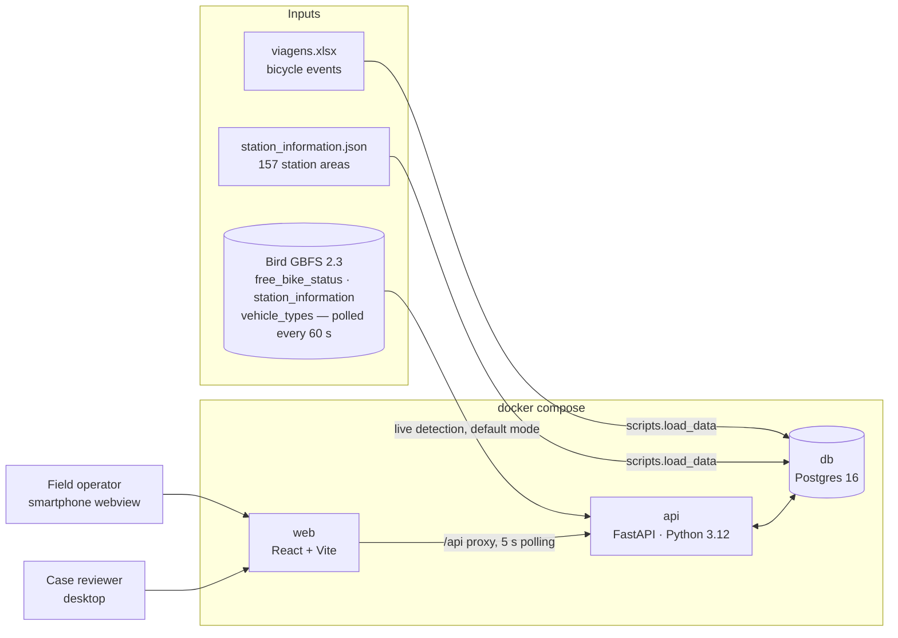
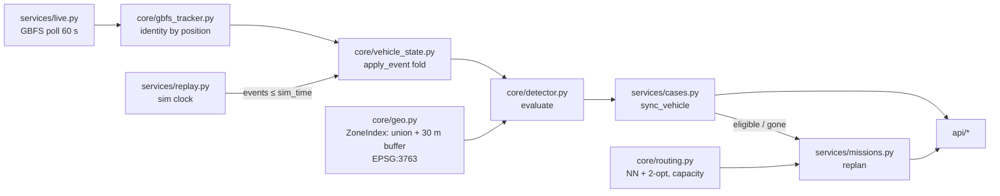
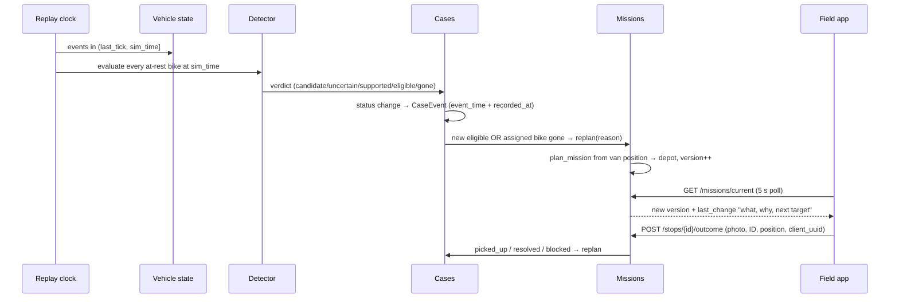

# Operations MVP — Architecture and Engineering Requirements

**24 September 2026 · hackathon MVP · implements [operations_requirements.md](operations_requirements.md)**

This document turns the product requirements into an engineering design for the operational MVP. The goal is a working demo by the Devpost deadline (25 Sep, 10:00), so it uses the simplest design that shows the full loop: **detect → case → route → field outcome → re-route**. The task plan is in [TASKS.md](TASKS.md) and the stack decision is in [adr/0001-stack.md](adr/0001-stack.md).

## 1. System context

| Container | Port | Responsibility |
|---|---|---|
| `db` | 5432 | Stations, vehicle events, cases with an append-only timeline, missions and stops. |
| `api` | 8000 | Replay clock, detector, case lifecycle, route planning, and the REST API. Docs at `/docs`. |
| `web` | 5173 | `/field`: mobile operator view in a webview/PWA. `/review`: desktop case review. Supports PT and EN. |

## 2. Detection sources: live (default) and replay (demo)

| Mode | Source | Clock | Fresh-evidence rule | Case `source` |
|---|---|---|---|---|
| **Live** (starts with the API) | Provider GBFS feeds listed in `datasets/gbfs.json`, polled every `GBFS_POLL_S`=60 s (the feed's ttl) | Wall clock (UTC) | **On**: every poll re-observes parked bikes | `live` |
| Replay (demo) | Supplied history `viagens.xlsx` | Simulated | Off (`REPLAY_REQUIRE_FRESH_OBSERVATION=false`) | `replay` |

The two modes are exclusive. `POST /api/replay/start` or `/step` pauses live polling, and `POST /api/live/start` resumes it and pauses the replay.

**Tracking bikes although the public ID rotates.** Measured on 24 Sep: two `free_bike_status` snapshots taken 70 s apart shared **0 of 855 `bike_id`s**, but **757 had identical coordinates** and 754 of those had an unchanged battery level. `core/gbfs_tracker.py` therefore identifies a parked vehicle as a sighting of the same `vehicle_type_id`, within `MOVE_TOLERANCE_M` (10 m), with a battery level within 0.05. Exact matches are tried first, then the nearest match. Each vehicle gets a stable internal ID such as `bicycle-3f2a9c1e0b4d`, and a re-sighting is a fresh same-position observation. It emits the same `Event`s as the provider log, so the detector is unchanged:

| Feed signal | Event / state | Effect |
|---|---|---|
| New vehicle not matching a track | `gbfs_appeared`, `available` | Parking clock starts at the first sighting. This is a **lower bound**, because the feed has no parking history. |
| Re-sighted at the same spot | `located` | The clock continues, and the sighting counts as fresh evidence. |
| `is_disabled` | `non_operational` | Still at rest. |
| `is_reserved` | `reserved` | Not at rest, so it leaves the route. |
| `last_reported` older than `GBFS_STALE_REPORT_MIN` (30) | `non_contactable` | Marked **uncertain** and never dispatched. |
| Missing for longer than `GBFS_GONE_GRACE_S` (180 s) | `gbfs_disappeared`, `not_in_feed` | Case resolved: "trip started or provider pickup". The stop is removed. |

- **Stations:** station areas are refreshed from live `station_information` every 30 min, so the buffer uses the shape that applied at the time of each observation. `vehicle_types` gives the form factor. The feed contains about 600 scooters and 250 bicycles, and `GBFS_FORM_FACTORS=bicycle` limits detection to bicycles, which is the scope of the first release.
- **Stored events:** only transitions (appeared, disappeared, state change) are stored in `vehicle_events` with `source=gbfs`, rather than about 250 rows per minute. Folding them at startup restores parking clocks after an API restart.
- **Limits to state in the pitch:**
  - Two identical bikes swapping places inside 10 m look like one bike.
  - A bike taken for a short trip and returned to the exact spot within 3 minutes keeps its clock.
  - Real use still needs the provider's authorised feed with stable IDs (§11 of the requirements).

## 3. Backend components

The code is split into three layers. `app/core` is pure Python (no DB, no HTTP) and is fully unit-tested. `app/services` connects the core to the database. `app/api` contains thin HTTP handlers.

| Module | Status | Contract |
|---|---|---|
| `core/geo.py` | done, tested | `ZoneIndex(areas, buffer_m).distance_outside_m(lat, lng)` returns 0 when the point is inside the area or on its boundary, and metres outside otherwise. |
| `core/vehicle_state.py` | done, tested | `apply_event(prev, Event, move_tolerance_m) -> VehicleState` gives `rest_since` and `last_observed_at_rest`. |
| `core/detector.py` | done, tested | `evaluate(state, distance_fn, now, Rules, field_confirmed) -> Result(verdict, reason, ...)`. |
| `core/routing.py` | done, tested | `plan_mission(start, stops, depot, capacity) -> Plan(order, queued, total_km)`. |
| `services/replay.py` | done, tested | `ReplayEngine.tick(to_time)`: folds events ≤ `sim_time`, evaluates all bikes at rest, syncs cases, replans. Runs as an asyncio loop at `REPLAY_SPEED`. |
| `services/cases.py` | done, tested | `sync_all(db, states, distance_fn, now, rules) -> replan reasons`. One open case per device. A closed interval (pickup, not found) is never re-detected. |
| `services/missions.py` | done, tested | `replan`, `replan_all`, `record_outcome` (idempotent on `client_uuid`), `depot_arrived`. Stops leave the route when their case stops being routable. |
| `core/gbfs_tracker.py` | done, tested | `Tracker.update(sightings, now) -> [Event]`: matching by position, type and battery; grace period before a bike counts as gone; `restore()` after a restart. |
| `services/live.py` | done, tested | `LiveEngine.poll_once(now)`: fetch the feeds, refresh stations, track, fold, sync cases (`source=live`), replan. Runs as an asyncio loop that starts with the API. |
| `services/clock.py` | done | `now()` returns replay time in demo mode and wall-clock UTC otherwise. |
| `scripts/load_data.py` | done | Loads 157 stations and 53,764 events, converting to UTC at ingestion. |

## 4. Key flow: detection to re-route

## 5. Detection rule as implemented

The source is operations_requirements.md §4. Thresholds are defined only in `app/config.py` and `.env`.

| Requirement | Implementation | Test |
|---|---|---|
| Station area + 30 m buffer (not a circle around the centre); the boundary counts as inside | `unary_union(areas)` → EPSG:3763 → `.buffer(30)`; check with `covers()` | `test_geo.py` |
| Strictly more than 120 min | `minutes <= 120` → candidate | `test_exactly_120_minutes_is_still_candidate` |
| A trip end alone never dispatches | Past the threshold without a fresh observation → `supported`, not `eligible` | `test_trip_end_only_never_becomes_eligible` |
| Fresh observation or field confirmation is required | Same-position event after `rest_since`, at most `FRESH_MAX_AGE_MIN` old | `test_fresh_observation_*`, `test_field_confirmation_*` |
| A cancelled trip resets only on real movement | Movement greater than `MOVE_TOLERANCE_M` (10 m) | `test_cancelled_trip_*`, `test_gps_jitter_*` |
| Location error that overlaps the permitted area → uncertain | `distance <= location_error_m` | `test_location_error_*` |
| `non_contactable` / `missing` → uncertain, not dropped | Keeps the last position and marks the case uncertain | `test_non_contactable_is_uncertain` |
| A new trip or provider pickup removes the bike | Non-rest state → `gone` → case resolved and stop removed | `test_trip_start_*`, `test_provider_pickup_*` |

**Assumptions to confirm:** the source timestamps are UTC (`SOURCE_TZ`). The B1 check found that trip starts are lowest at 04 UTC and highest at 16–17 UTC. That fits UTC but does not rule out local time, so confirm with the data partner. Only display is affected, because the rule uses time differences; `FRESH_MAX_AGE_MIN=60`; `DEFAULT_LOCATION_ERROR_M=0` because the feed has no accuracy field; the depot is the Complexo Multisserviços at 38.736686, -9.386868 (source: CMC); `VAN_CAPACITY=6`. **Measured:** with the strict rule, 7 replayed days produce only 1 eligible bike, so the demo default is `REQUIRE_FRESH_OBSERVATION=false`. Set it to `true` for real use. The UI labels those cases "fresh-evidence rule disabled".

## 6. Data model

| Table | Key fields | Notes |
|---|---|---|
| `stations` | id, name, lat, lng, area (GeoJSON) | Snapshot from 11 Sep 2026. |
| `vehicle_events` | id, source (history/gbfs), vehicle_type_id, device_id, state, event_types[], lat, lng, trip_id, event_time, battery, received_at | Supplied data is immutable. `received_at` stores when the information reached staff. |
| `cases` | device_id, status, source (live/replay/field), lat, lng, rest_since, distance_outside_m, reason, field_confirmed, needs_approval, blocked_reason | One open case per device. |
| `case_events` | case_id, kind, detail JSON, actor, event_time, recorded_at | **Append-only** evidence timeline. Corrections store `before` and `after` values. |
| `missions` | operator_id, status, capacity, start position, **version**, last_change, total_km | `version` increases on every replan. |
| `stops` | mission_id, case_id, seq, kind (pickup/verify/depot), status, outcome, photo_path, actual position, confirmed_device_id, **client_uuid** | `client_uuid` makes offline resubmits idempotent. |

Case statuses are `candidate → uncertain → supported → eligible → assigned → picked_up | resolved`. Stop outcomes are `picked_up, not_found, in_use, provider_recovered, unsafe, inaccessible, unable_to_load`.

## 7. API contract

Swagger UI is at `http://localhost:8000/docs`. The TypeScript mirror is `frontend/src/types.ts`; change it in the same commit as `schemas.py`.

| Method | Path | Status |
|---|---|---|
| GET | `/api/health`, `/api/stations` | done |
| GET | `/api/cases?status=`, `/api/cases/{id}` (includes timeline) | done |
| POST | `/api/cases/field` (operator-found bike, needs approval) | done |
| POST | `/api/cases/{id}/approve?actor=` | done (triggers replan) |
| PATCH | `/api/cases/{id}` (correction/override with actor and reason) | done |
| GET | `/api/cases/{id}/export` (evidence JSON) | done (format T-E4) |
| GET | `/api/missions/current?operator_id=` | done (read) |
| POST | `/api/missions/replan` `{operator_id, lat, lng}` (creates the mission on first call) | done |
| POST | `/api/missions/{id}/depot` `{lat, lng}` (unloaded; frees capacity) | done |
| POST | `/api/stops/{id}/outcome` (multipart: outcome, actor, lat, lng, device_id, photo, client_uuid) | done |
| GET | `/api/uploads/{photo_path}` (pickup photos) | done |
| GET/POST | `/api/live`, `/live/start`, `/live/pause`, `/live/poll` (live feed status: vehicles in feed, tracked, last error) | done |
| GET/POST | `/api/replay`, `/replay/start?from_time=&speed=`, `/replay/pause`, `/replay/step?minutes=`, `/replay/reset` | done |

## 8. Engineering requirements (MVP acceptance)

| ID | Requirement | Maps to ops req §10 |
|---|---|---|
| ER-1 | `docker compose up` followed by `make seed` gives a working stack on a clean machine. | — |
| ER-2 | Detector unit tests cover every rule in §4 and pass (`make test`). | 1, 2, 3 |
| ER-3 | Replay never reads events after `sim_time`. Simulated field or provider actions are marked `simulated`. | §9 |
| ER-4 | An eligible case enters a route automatically. A trip start or provider pickup removes the stop, and the case history remains. | 4 |
| ER-5 | Unsafe or inaccessible outcomes set `blocked_reason`. The case stays visible in review and is excluded from routing. | 5 |
| ER-6 | The route respects `VAN_CAPACITY`. Extra cases stay queued. Each route ends at the depot. | 6 |
| ER-7 | A pickup is rejected without a bicycle ID and a photo. A field-found bike cannot be routed until approved. | 7 |
| ER-8 | The field app keeps the last route when a request fails. Outcomes are queued locally and resent with the same `client_uuid`. | 8 |
| ER-9 | Every route change shows "what changed, why, next target" in the field app. | §6 |
| ER-10 | Every correction stores the actor, time, reason, and previous values. | §4, §8 |

## 9. Out of scope for the MVP (scaling notes for the pitch)

- **Live data:** the public GBFS feed is live now, with position-based tracking. For production, use the provider's authorised MDS/GBFS feed with stable IDs and movement events. It can feed the same `Event` pipeline.
- **Routing:** replace the haversine × 1.3 matrix with OSRM road distances, and NN + 2-opt with an OR-Tools CVRP for several vans.
- **Push:** replace 5 s polling with SSE or WebSocket. Add web push for route changes.
- **Auth and roles:** reviewer and operator permissions are still to be confirmed. The MVP uses a free-text `actor`.
- **Migrations:** replace `create_all` with Alembic once the schema is stable.
- **Native shell:** wrap `/field` in a Capacitor or TWA webview if a store app is needed.
