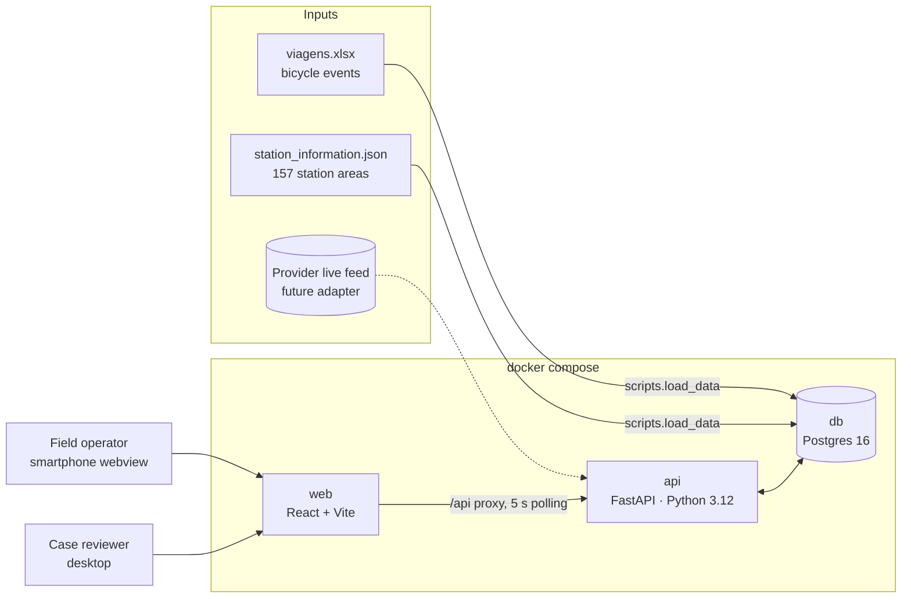
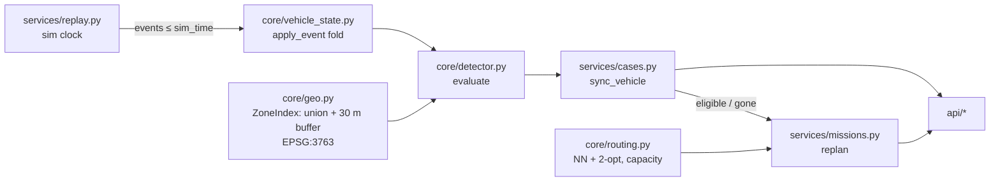
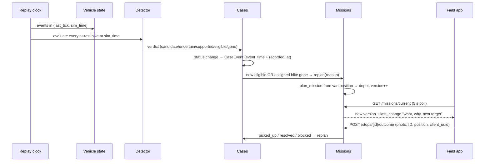

# Operations MVP — Architecture and Engineering Requirements

**24 September 2026 · hackathon MVP · implements [operations_requirements.md](operations_requirements.md)**

This document turns the product requirements into an engineering design for the operational MVP. The goal is a working demo by the Devpost deadline (25 Sep, 10:00), so it uses the simplest design that shows the full loop: **detect → case → route → field outcome → re-route**. The task plan is in [TASKS.md](TASKS.md) and the stack decision is in [adr/0001-stack.md](adr/0001-stack.md).

## 1. System context

| Container | Port | Responsibility |
|---|---|---|
| `db` | 5432 | Stations, vehicle events, cases with an append-only timeline, missions and stops. |
| `api` | 8000 | Replay clock, detector, case lifecycle, route planning, and the REST API. Docs at `/docs`. |
| `web` | 5173 | `/field`: mobile operator view in a webview/PWA. `/review`: desktop case review. Supports PT and EN. |

## 2. Backend components

The code is split into three layers. `app/core` is pure Python (no DB, no HTTP) and is fully unit-tested. `app/services` connects the core to the database. `app/api` contains thin HTTP handlers.

| Module | Status | Contract |
|---|---|---|
| `core/geo.py` | done, tested | `ZoneIndex(areas, buffer_m).distance_outside_m(lat, lng)` returns 0 when the point is inside the area or on its boundary, and metres outside otherwise. |
| `core/vehicle_state.py` | done, tested | `apply_event(prev, Event, move_tolerance_m) -> VehicleState` gives `rest_since` and `last_observed_at_rest`. |
| `core/detector.py` | done, tested | `evaluate(state, distance_fn, now, Rules, field_confirmed) -> Result(verdict, reason, ...)`. |
| `core/routing.py` | done, tested | `plan_mission(start, stops, depot, capacity) -> Plan(order, queued, total_km)`. |
| `services/replay.py` | **stub (T-B3)** | Background tick loop; no look-ahead past `sim_time`. |
| `services/cases.py` | **stub (T-B4)** | `sync_vehicle(db, state, result, now)`; the docstring holds the rules. |
| `services/missions.py` | **stub (T-C2, T-C4)** | `replan(...)` and `record_outcome(...)`. |
| `scripts/load_data.py` | done | Loads 157 stations and 53,764 events, converting to UTC at ingestion. |

## 3. Key flow: detection to re-route

## 4. Detection rule as implemented

The source is operations_requirements.md §4. Thresholds are defined only in `app/config.py` and `.env`.

| Requirement | Implementation | Test |
|---|---|---|
| Station area + 30 m buffer (not a circle around the centre); the boundary counts as inside | `unary_union(areas)` → EPSG:3763 → `.buffer(30)`; check with `covers()` | `test_geo.py` |
| Strictly more than 120 min | `minutes <= 120` → candidate | `test_exactly_120_minutes_is_still_candidate` |
| A trip end alone never dispatches | Past the threshold without a fresh observation → `supported`, not `eligible` | `test_trip_end_only_never_becomes_eligible` |
| Fresh observation or field confirmation is required | Same-position event after `rest_since`, at most `FRESH_MAX_AGE_MIN` old | `test_fresh_observation_*`, `test_field_confirmation_*` |
| A cancelled trip resets only on real movement | Movement greater than `MOVE_TOLERANCE_M` (10 m) | `test_cancelled_trip_*`, `test_gps_jitter_*` |
| Location error that overlaps the permitted area → uncertain | `distance <= location_error_m` | `test_location_error_*` |
| `non_contactable` / `missing` → uncertain, not dropped | Keeps the last position and marks the case uncertain | `test_non_contactable_is_uncertain` |
| A new trip or provider pickup removes the bike | Non-rest state → `gone` → case resolved and stop removed | `test_trip_start_*`, `test_provider_pickup_*` |

**Assumptions to confirm:** the source timestamps are UTC (`SOURCE_TZ`, check in T-B1); `FRESH_MAX_AGE_MIN=60`; `DEFAULT_LOCATION_ERROR_M=0` because the feed has no accuracy field; the depot coordinates are a **placeholder**; `VAN_CAPACITY=6`. For a demo where the historical data has too few same-position observations, set `REQUIRE_FRESH_OBSERVATION=false`. The UI labels those cases "fresh-evidence rule disabled".

## 5. Data model

| Table | Key fields | Notes |
|---|---|---|
| `stations` | id, name, lat, lng, area (GeoJSON) | Snapshot from 11 Sep 2026. |
| `vehicle_events` | id, device_id, state, event_types[], lat, lng, trip_id, event_time, battery, received_at | Supplied data is immutable. `received_at` stores when the information reached staff. |
| `cases` | device_id, status, source (detector/field), lat, lng, rest_since, distance_outside_m, reason, field_confirmed, needs_approval, blocked_reason | One open case per device. |
| `case_events` | case_id, kind, detail JSON, actor, event_time, recorded_at | **Append-only** evidence timeline. Corrections store `before` and `after` values. |
| `missions` | operator_id, status, capacity, start position, **version**, last_change, total_km | `version` increases on every replan. |
| `stops` | mission_id, case_id, seq, kind (pickup/verify/depot), status, outcome, photo_path, actual position, confirmed_device_id, **client_uuid** | `client_uuid` makes offline resubmits idempotent. |

Case statuses are `candidate → uncertain → supported → eligible → assigned → picked_up | resolved`. Stop outcomes are `picked_up, not_found, in_use, provider_recovered, unsafe, inaccessible, unable_to_load`.

## 6. API contract

Swagger UI is at `http://localhost:8000/docs`. The TypeScript mirror is `frontend/src/types.ts`; change it in the same commit as `schemas.py`.

| Method | Path | Status |
|---|---|---|
| GET | `/api/health`, `/api/stations` | done |
| GET | `/api/cases?status=`, `/api/cases/{id}` (includes timeline) | done |
| POST | `/api/cases/field` (operator-found bike, needs approval) | done |
| POST | `/api/cases/{id}/approve?actor=` | done (replan hook T-C3) |
| PATCH | `/api/cases/{id}` (correction/override with actor and reason) | done — only the fields sent are applied, so an explicit `null` unblocks |
| GET | `/api/cases/{id}/export?actor=` (evidence JSON) | done — rule applied, inference, observations, staff actions, field outcomes; `actor` also records the export in the timeline |
| GET | `/api/cases/kpis` (open cases, not-found rate, median eligible→pickup) | done (T-E6) |
| GET | `/api/missions/current?operator_id=` | done (read) |
| POST | `/api/missions/replan` | **501 → T-C2** |
| POST | `/api/stops/{id}/outcome` (multipart: outcome, actor, lat, lng, device_id, photo, client_uuid) | **501 → T-C4** |
| GET/POST | `/api/replay`, `/replay/start`, `/replay/pause`, `/replay/step?minutes=` | **stub → T-B3** |

## 7. Engineering requirements (MVP acceptance)

| ID | Requirement | Maps to ops req §10 |
|---|---|---|
| ER-1 | `docker compose up` followed by `make seed` gives a working stack on a clean machine. | — |
| ER-2 | Detector unit tests cover every rule in §4 and pass (`make test`). | 1, 2, 3 |
| ER-3 | Replay never reads events after `sim_time`. Simulated field or provider actions are marked `simulated`. | §9 |
| ER-4 | An eligible case enters a route automatically. A trip start or provider pickup removes the stop, and the case history remains. | 4 |
| ER-5 | Unsafe or inaccessible outcomes set `blocked_reason`. The case stays visible in review and is excluded from routing. | 5 |
| ER-6 | The route respects `VAN_CAPACITY`. Extra cases stay queued. Each route ends at the depot. | 6 |
| ER-7 | A pickup is rejected without a bicycle ID and a photo. A field-found bike cannot be routed until approved. | 7 |
| ER-8 | The field app keeps the last route when a request fails. Outcomes are queued locally and resent with the same `client_uuid`. | 8 |
| ER-9 | Every route change shows "what changed, why, next target" in the field app. | §6 |
| ER-10 | Every correction stores the actor, time, reason, and previous values. | §4, §8 |

## 8. Out of scope for the MVP (scaling notes for the pitch)

- **Live data:** add a `ProviderSource` adapter that uses the same `Event` type. The public GBFS `bike_id` rotates, so live use needs an authorised provider feed with stable IDs.
- **Routing:** replace the haversine × 1.3 matrix with OSRM road distances, and NN + 2-opt with an OR-Tools CVRP for several vans.
- **Push:** replace 5 s polling with SSE or WebSocket. Add web push for route changes.
- **Auth and roles:** reviewer and operator permissions are still to be confirmed. The MVP uses a free-text `actor`.
- **Migrations:** replace `create_all` with Alembic once the schema is stable.
- **Native shell:** wrap `/field` in a Capacitor or TWA webview if a store app is needed.
